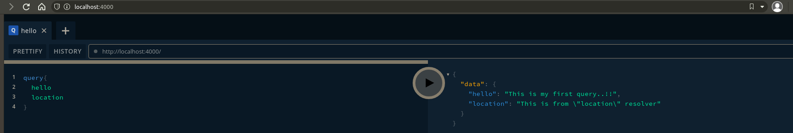
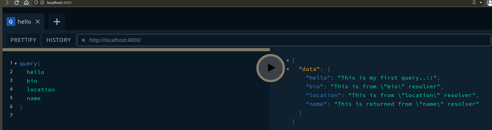

# Where it is used

1. Most of the recent applications work upon REST API's(web or mobile) which basically runs with client-server architecture where in the server we deal with backend and databases like MongoDB,SQL.
2. No Matter the backend used, we can any client / backend server language we communicate via HTTP REST API Calls.
3. We have different REST API Endpoints according to our application, Here we dont change anything on REST but **replace many rest api endpoint with many endpoints of graphql with single endpoint exposed to client**
4. This is also operated on HTTP Calls/methods. This means we can use any client end and server end languages and communicate uniformly.

# What is GraphQL

Graph Query Language : creates Fast and Flexible API's, giving client the complete control of asking information that it needs to show to user. This is achieved with following [advantages](#advantages)

## What is graph?

Unlike graphs used in charts, or excel., Here graph denotes a way of approach to view your application data and how your data related to one another.Here we declare the structure/fields of a data we need, this is called as **_types_** (just like collections in mongodb)

# Why GraphQL is used && why it is popular

1. fast
   1. In Rest api, we fetch details or data based on the endpoint, if we need other details based on current data then we do need to create a new REST call to server with our query. This is not the case in the GraphQL, Since it has only one endpoint exposed while fetching data we query everything we need and graphQL fetches it once and for all.
   2. data needed to display is decided by the client which unlike it rest api
2. flexible
   1. This means that even though you can combine or changes the REST API's to fetch multiple details in a single go.. it increases the data and time consumption of the client to preview the details fetched from server to client. This may not provide the UX upto the mark.
   2. Facebook had the same problem where desktop application and mobile application didnt needed the same data to display what they have to work upon same existing HTTP Calls.
   3. This is where flexibility comes in making the queries as per application or situation on HTTP and having fetched different data we need as per application or situation or platform.
   4. Here efficiency is dependent on client is responsible what data to be queried rather than server who sends the data.
   5. whenever you want to create a special endpoint for special type of data, In Rest you always need to create and expose a new endpoint which is not a case in GraphQL as a query can fulfill such requirement.
   6. It doesnt care what backend you use, it works on any language (SQL and NoSQL).
3. easy to maintain
   1. Due point in 2.5 it is easier to maintain the endpoints we needed in our application rather than REST
4. All of the qraphql code is self documented, means whenever you try your data on any graphql editor you can see suggestions and related error message seen according to your data present.
   1. This means graphql exposes application schema which describes the fields and operations that could be performed on the endpoint/operation of graphql
   2. In the REST API's one need to document all these endpoints for all the updates as well, if nobody doesnt do it, the documentation eventually becomes obsolete. This is not the case in graphql due to self documenatation thing.

# [Advantages](#advantages)

1. Fewer Http calls
2. Flexible data querying
3. less code to manage
4. control on endpoints created in an application

---

# [Queries](#queries)
Before querying a server of graphql, you need to understand few points to create them

   1. **_Type Definitions_** :

        * Also known as Application schema( to be precise it defines what our data looks like)
        * this where is we define all operations we do
        * This is very important to work with graphql

   2. **_Resolvers of API's_**:
        * Nothing more set of functions that run for each of the opertaions that are performed on graphql server
        * These are actual functions that run when perform any action on graphql

You can checkout the code for graphql-yoga for our project in [here](./graphql-course/graphql-basics/src/index.js)

---

## creating and running first graphql query

1. head over [here](https://graphql-demo.mead.io) to open graphql playground online
2. Operations present in graphql : <br/>
### Query : Fetch data from graphql

```graphql
query { #just declares the fields you need in different lines without commas
    hello# now whenever you type some thing in graphql editor you can see suggestion of fields present in your data here. this is called as self documentation since this suggestions changes whenever you change you data schema
    course
}
```

### Nested Queries : 

```graphql
query { 
    hello
    course
    me { #nested query 
        id
        name
        comments { #nested query fetches all the comment present in the me object
            id
            text
        }
    }
    user(limit 2){
        id
    }
}
```

### Mutation : Being able to change data
### Subscription : allows us to watch data for changes(better suited for real time applications)


# [YogaIntegration](#yogaintegration):

* This is a responsiblity of individual developer to write/query or to create their own implementation from their experienced backends to graphql
* This means we have multiple implementations to pick from implemetation methods/clients/servers in graphql
* For our project purpose, we're gonna use **_Yoga_** inorder to setup graphql on nodejs server
* Now lets checkout the configuation steps of yoga [here](https://github.com/dotansimha/graphql-yoga)
* You can checkout the code for graphql-yoga for our project in [here](./graphql-course/graphql-basics/src/index.js)
* Now when you run your code from above file, and open up application from http://localhost:4000 we can to see graphQL playground where we can query our queries in the playground <br/>


This is the first graphql query from nodejs
 <br/>
Displaying all our data
