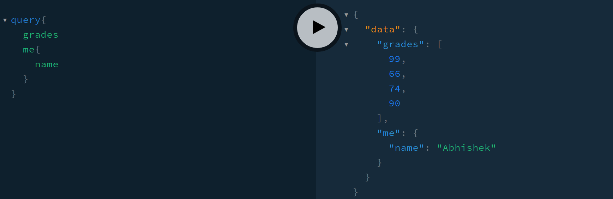
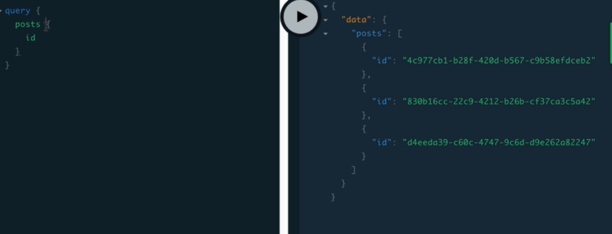

# Datatypes present in GraphQL

1. ['Scaler'](#scalar)
2. ['Custom'](#vector)

## [Scalar](#scalar)

1. Built in datatypes present in graphql
2. These are single discrete value
3. List of them are
   1. String
   2. Integers
   3. Float
   4. Boolean
   5. ID : This is unique to graphql, similar to string but only used to assign ID's to objects

## [Custom](#custom)

1. These are combinations of above scaler types
2. List of them are
   1. Arrays
   2. Objects

### Creating Custom Types

Note: while specifying the custom values in type definition, you always need to specify the scalars present in them
Check file [here](./graphql-course/graphql-basics/src/index.js) (Check custom queries)

### Working with arrays

Syntax:

```graphql
type Query{
   testArray: [Int!] #this declares an integer array is needed for testArray
   # Int! - denotes each element of array is non-nullable and should be an Integer
}
```

Now in resolver

```javascript
   testArray(){
      //return data that you want show to user
      return [1,2,3,54];
   }
```

check `grades` definition in [here](graphql-course/graphql-basics/src/index.js) for more.

Lets checkout output from above link <br>


### Notice: that for above scalar-type of array we dont need to define any argument while using arrays.

But this is not the case for the custom-type of arrays. At that time we need to specify the fields we need while fetching data
