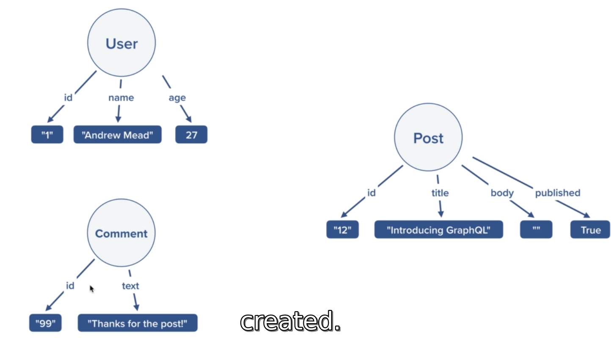
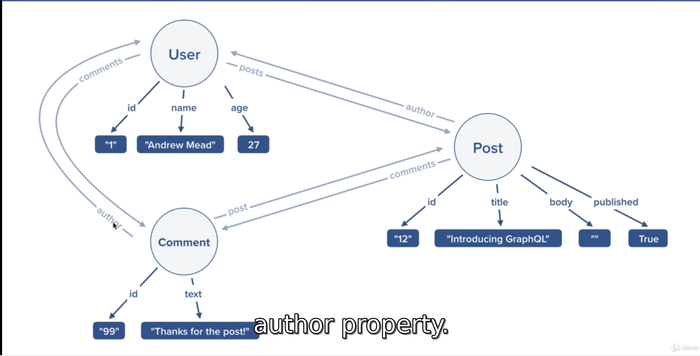

1. this is will be in nodejs and graphql
2. here we do have users who can sign-in and signup into our applications
3. users gonna create the posts where other users can commit on a post
4. hence we are going to save data information about users, posts and commentts
5. In graphql, these are known as **_types_**
6. for each type we're gonna have a unique id and as shown in image <br>

7. Then study the types of relationships present in the types of the data<br/>

8. setting boilerplate for the project.
   1. open new folder 'graphql-course/graphql-basics'
   2. install [babel](#https://babeljs.io) (This is just a javascript compiler which helps us to write ES6 codes and babel later converts it to ES5) for our project
   3. create package.json with babel and babel-preset <br>
        ```npm
        npm install --save-dev @babel/core @babel/node @babel/cli
        npm install @babel/preset-env --save-dev
        ```
   4. Now to use above packages and to tell babel to use Node env we need to have following configurations <br>
   ### (Note: Folllowing steps are only for the development area, for production and deployment there are steps to configure in babel which will be discussed later)
      1. create a new file `.babelrc` with content as
            ```babelrc
            {
                "presets":[
                    ["@babel/preset-env"]
                ]
            }
            ```
      2. Now create `src/index.js` path in graphql-basics folder
      3. Now to run the babel-script of index.js, update the package.json#scripts as
            ```json
            {
                "scripts":{
                    "start":"babel-node src/index.js",
                    ...
                }
            }
            ```
      4. create a new file `src/MyModule.js` 
      5. Lets install a npm module used to run graphql on nodejs, which is **_Yoga_** (`npm i graphql-yoga`)
   1. ### Installing Spread Operator via Babel plugin

      1. in project's root folder, install via cmd : `npm i babel-plugin-transform-object-rest-spread` to install spread opertor support in babel
      2. then append following lines in `.babelrc`

      ```babel
          "plugins":[
              "transform-object-rest-spread"
          ]
      ```