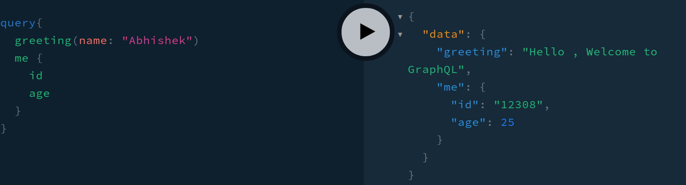
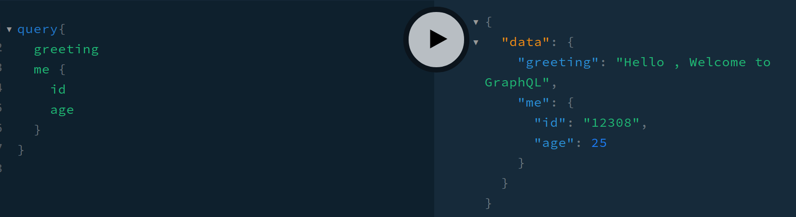

# Operational Arguements

## where we use

1. this is mainly used to send data from client to server
2. essential for form submissions in front end
3. Also used for pass some query/parameters to an url in order to filter our query at server end

## how to use

In the typedef, for key you need to pass along them in the `()` as following

``` graphql
# sample query params
type Test{
    greeting(name: String!): String!
}
```

Now in order to receive those params from the type definition we can use built in params given in resolvers (These params are present or applicable to all resolvers). Some of them are

1. parent : useful when working with relational data
2. args : sends the information regarding args sent from type definition to resolver
3. context(ctx) : this is useful for contextual data (like if user is logged in context data denotes information about user which can be accessible through out the application)
4. info : contains details about actual operations that were sent along to server

Thus we need to create a resolver `Test` to handle `Test` type Definition along with **args** param

```javascript
Test{
    greeting(parent,args,context,info){
        console.log(args)
    }
}
```

Check [here](graphql-course/graphql-basics/src/index.js) in project development

### Output from Project Development/above file link

1. with query params <br>

1. without query params <br>
